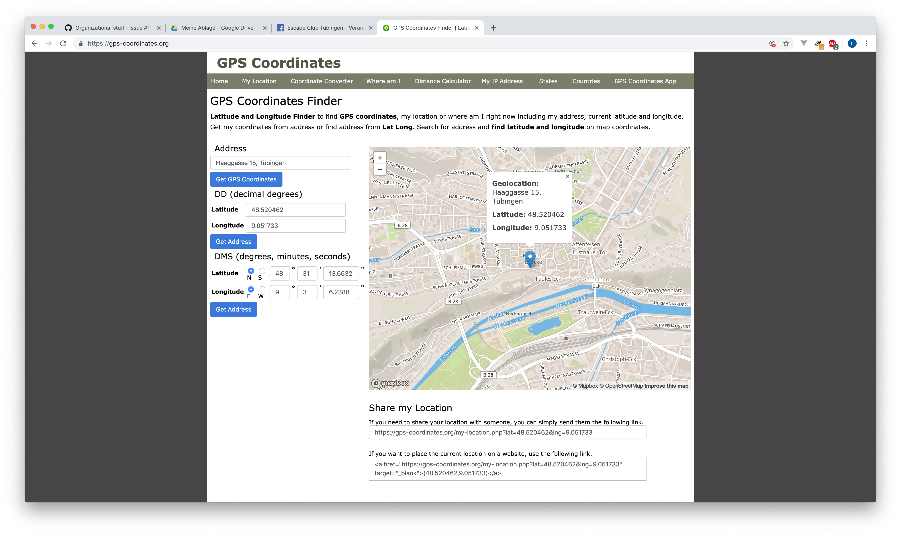
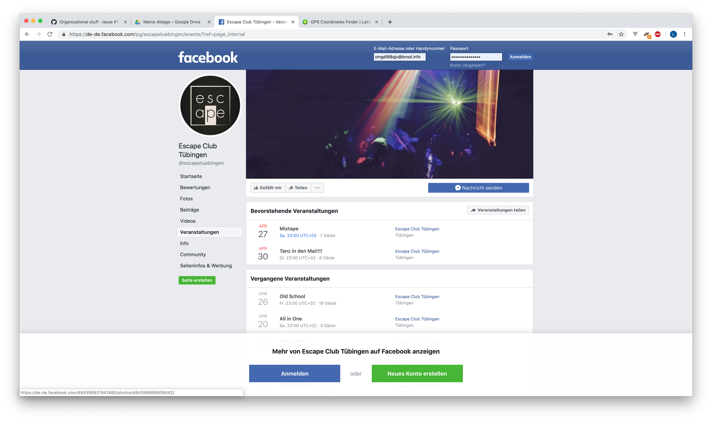

# Adding new content

There are two ways how to add new content to eventzimmer. Either:

- directly add events using the eventzimmer calendar
- adding a new source from which eventzimmer aggregator will get new events.

Both ways will be discussed in this guide.

# First things first - location

Before you can add a source or an event, please always make sure that you added a corresponding location.
Eventzimmer will simply ignore events with unknown locations.

Adding a location step by step like this:

- look up the location address e.g with Google
- use [gps-coordinates.com](gps-coordinates.org) to look up the coordinates of the location

This is shown in below image:

## Adding the location to eventzimmer

Use the _"Locations"_ spreadhseet to add a new location like this:

- add a new row
- make sure the name for the location is the name that you (or the event source, e.g Facebook) will use
- from the _"Format"_ use _"Format_" > _"Number"_ > _"Only text"_ on the new latitude and longitude cells in order to copy the latitude and longitude
- copy the latitude and longitude
- make sure copying was successfull and you don't have weird numbers like 46.8.9!

# Adding a new source

In order to add a new event source please:

- **make sure** you added the location!
- use the _"Sources"_ spreadhseet
- add a new row
- if the source is Facebook, use _"Facebook"_ as aggregator
- if the source is iCalendar, use _"iCal_" as aggregator
- add the source url in the url column

You can easily spot a Facebook url as shown in below screenshots:

The url will be the `https://facebook.com/pg/NAME/events/` part and the `?ref=page_internal` can be skipped.

# Adding a new event

You can add events to eventzimmer using the public calendar.

When adding a new event via the calendar make sure:

- that you added the location of the event!
- events are not updated once you add them to the calendar, so better make sure they are accurate :)
