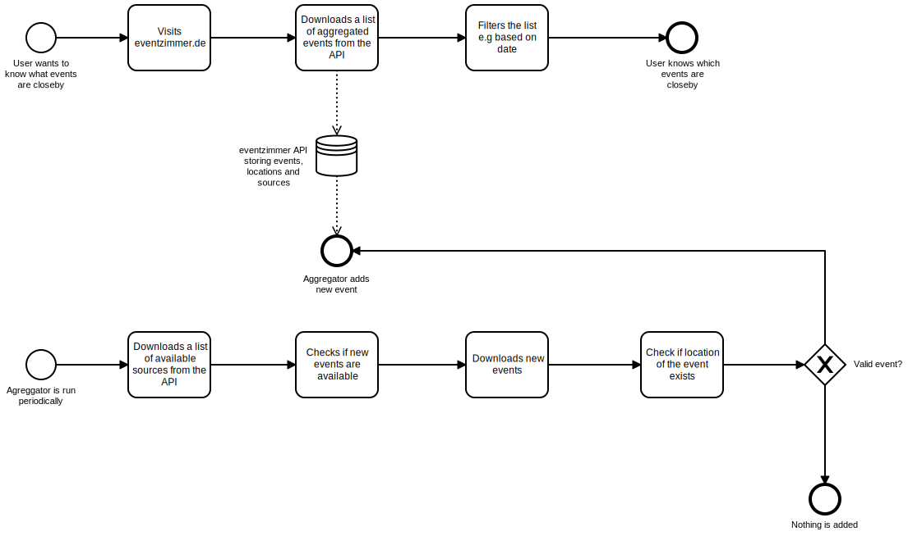

eventzimmer
-----------

`eventzimmer` is an event aggregation service that makes it possible to aggregate events from a multitude of services (such as iCalendar and Facebook).

The aggregated events can then be displayed via a frontend (as a list).

# Architecture

`eventzimmer` consists of multiple parts that play together that are briefly covered in this section:

- an [API server](https://docs.eventzimmer.de) which stores events
- an aggregation tool which uses predefined sources to discover new events
- a [web frontend](https://eventzimmer.de), which can list the events from the API server.

The application process of eventzimmer is illustrated below:

For an introduction into the individual services, please have a look at their respective GitHub repositories.

## Organization structure

`eventzimmer` is currently a non-profit organisation. It is the brainchild of _"Fohlen"_ and _"Maxi"_.
All our services are hosted free of charge and are made possible because of open source.

We would like to thank these amazing organizations to host us, and many million people more, free of charge:

- [GitHub](https://github.com/)
- [Netlify](https://netlify.com)
- [Heroku](https://heroku.com)
- [Auth0](https://auth0.com)
- [Hostiero](https://www.hostiero.com/)
